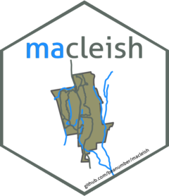

# macleish 

<!-- badges: start -->

[](https://github.com/beanumber/macleish/actions)
[](https://cran.r-project.org/package=macleish)
[](https://lifecycle.r-lib.org/articles/stages.html#stable)
<!-- badges: end -->

The [Ada and Archibald MacLeish Field
Station](https://www.smith.edu/about-smith/sustainable-smith/macleish)
is a 260-acre patchwork of forest and farmland located in West Whately,
MA that provides opportunities for faculty and students to pursue
environmental research, outdoor education, and low-impact recreation.

<figure>

<figcaption aria-hidden="true">MacLeish Field Station</figcaption>
</figure>

This R package allows you to download and process weather data using the
[ETL](https://github.com/beanumber/etl) framework from the MacLeish
Field Station. It also contains shapefiles for contextualizing spatial
information.

## To install

``` r
install.packages("macleish")
```

## Use 2015 weather data

Weather data from 2015 is available immediately from both the `Whately`
and `Orchard` weather stations.

``` r
library(macleish)
glimpse(whately_2015)
```

    ## Rows: 52,560
    ## Columns: 8
    ## $ when            <dttm> 2015-01-01 00:00:00, 2015-01-01 00:10:00, 2015-01-01 …
    ## $ temperature     <dbl> -9.32, -9.46, -9.44, -9.30, -9.32, -9.34, -9.30, -9.10…
    ## $ wind_speed      <dbl> 1.399, 1.506, 1.620, 1.141, 1.223, 1.090, 1.168, 1.307…
    ## $ wind_dir        <dbl> 225.4, 248.2, 258.3, 243.8, 238.4, 241.7, 242.3, 244.2…
    ## $ rel_humidity    <dbl> 54.55, 55.38, 56.18, 56.41, 56.87, 57.25, 57.71, 58.16…
    ## $ pressure        <int> 985, 985, 985, 985, 984, 984, 984, 984, 984, 984, 984,…
    ## $ solar_radiation <dbl> 0, 0, 0, 0, 0, 0, 0, 0, 0, 0, 0, 0, 0, 0, 0, 0, 0, 0, …
    ## $ rainfall        <dbl> 0, 0, 0, 0, 0, 0, 0, 0, 0, 0, 0, 0, 0, 0, 0, 0, 0, 0, …

``` r
glimpse(orchard_2015)
```

    ## Rows: 52,547
    ## Columns: 9
    ## $ when         <dttm> 2015-01-01 00:00:00, 2015-01-01 00:10:00, 2015-01-01 00:…
    ## $ temperature  <dbl> -9.62, -9.45, -9.52, -9.68, -9.56, -9.59, -9.51, -9.70, -…
    ## $ wind_speed   <dbl> 0.490, 0.517, 0.576, 0.522, 0.296, 0.382, 0.497, 0.781, 0…
    ## $ wind_dir     <dbl> 216.3, 209.6, 215.5, 199.3, 186.4, 183.9, 195.6, 210.4, 2…
    ## $ rel_humidity <dbl> 61.97, 59.08, 58.69, 58.59, 57.32, 57.58, 56.97, 60.52, 6…
    ## $ pressure     <dbl> 1020, 1019, 1019, 1019, 1019, 1019, 1019, 1018, 1018, 101…
    ## $ par_density  <dbl> 0.548, 0.548, 0.548, 0.548, 0.548, 0.548, 0.548, 0.548, 0…
    ## $ par_total    <dbl> 0.088, 0.088, 0.088, 0.088, 0.088, 0.088, 0.088, 0.088, 0…
    ## $ rainfall     <dbl> 0, 0, 0, 0, 0, 0, 0, 0, 0, 0, 0, 0, 0, 0, 0, 0, 0, 0, 0, …

## Live weather data

Weather readings are logged every 10 minutes. Current and historical
(dating back to 1/3/2012 for `whately` and 6/27/2014 for `orchard`)
meteorological readings are available through the
[ETL](https://github.com/beanumber/etl) framework. Please see the
documentation for that package for more information about how this
works.

``` r
macleish <- etl("macleish")
macleish |>
  etl_update()
```

``` r
whately <- macleish |>
  tbl("whately")
whately |>
  mutate(the_year = strftime('%Y', when)) |>
  group_by(the_year) |>
  summarize(N = n(), begin = min(when), end = max(when), avg_temp = mean(temperature))

orchard <- macleish |>
  tbl("orchard")
orchard |>
  mutate(the_year = strftime('%Y', when)) |>
  group_by(the_year) |>
  summarize(N = n(), begin = min(when), end = max(when), avg_temp = mean(temperature))
```

``` r
daily <- whately |>
  mutate(the_date = date(when)) |>
  group_by(the_date) |>
  summarize(N = n(), avgTemp = mean(temperature)) |>
  collect()

library(ggplot2)
ggplot(data = daily, aes(x = as.Date(the_date), y = avgTemp)) +
  geom_point() + geom_smooth()
```

## Maps

Spatial data is available through the `macleish_layers` data object.

``` r
class(macleish_layers)
```

    ## [1] "list"

``` r
names(macleish_layers)
```

    ##  [1] "landmarks"         "forests"           "streams"          
    ##  [4] "challenge_courses" "buildings"         "wetlands"         
    ##  [7] "boundary"          "research"          "soil"             
    ## [10] "trails"            "camp_sites"        "elevation"

``` r
library(leaflet)
leaflet() |>
  addTiles() |>
  addPolygons(
    data = macleish_layers[["boundary"]], 
    weight = 1, fillOpacity = 0.1
  ) |>
  addPolygons(
    data = macleish_layers[["buildings"]], 
    weight = 1, popup = ~ name
  ) |>
  addPolylines(
    data = macleish_layers[["trails"]], 
    weight = 1, color = "brown",
    popup = ~ name
  ) |>
  addPolylines(
    data = macleish_layers[["streams"]], 
    weight = 2
  ) |>
  addMarkers(
    data = filter(macleish_layers[["landmarks"]], grepl("Met", Label)), 
    popup = ~Label
  )
```

## Images

You can download live and historical images from Phenocam.

``` r
phenocam_image_url()
```

    ## [1] "https://phenocam.nau.edu/data/latest/macleish.jpg"

``` r
knitr::include_graphics(phenocam_image_url())
knitr::include_graphics(phenocam_image_url("2021-12-25 12:05:05"))
```


## See also

- [Ada and Archibald MacLeish Field
  Station](https://www.smith.edu/about-smith/sustainable-smith/macleish)
- **[etl](https://github.com/beanumber/etl)**
